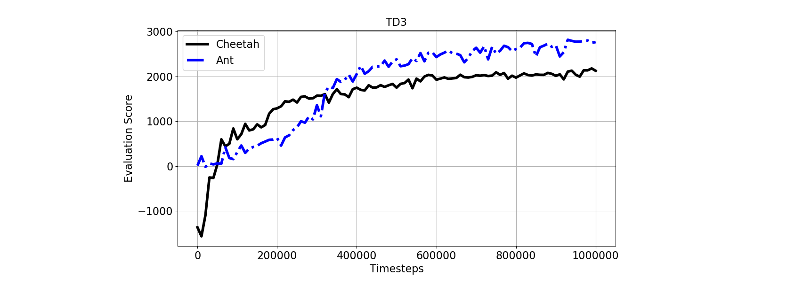

### TD3 implementation in PyTorch for PyBullet environments

Fujimoto, Scott, Herke Van Hoof, and David Meger. "Addressing function approximation error in actor-critic methods." arXiv:1802.09477 (2018).

Simply run the notebook on Google Collab.

Code structure:
* evaluate_policy(): computes the return for the current policy over an evaluation period
* train(): main function that implements training
* Class ReplayBuffer(): defines experience replay memory and add/sample experience methods
* Class Actor(): Inherited from torch.nn.Module, defines the actor network structure 
* Class Critic(): Inherited from torch.nn.Module, defines the critic network structure 
* Class TD3Agent():

   learn():implements the core TD3 logic

   act(): executes current policy from a given state via forward pass on the local actor

   soft_update(): polyak averaging of the local and target network parameters

   hard update(): copies local network parameters to target network parameters

   save_checkpoints():saves trained weights

   load_checkpoints():loads trainged weights

